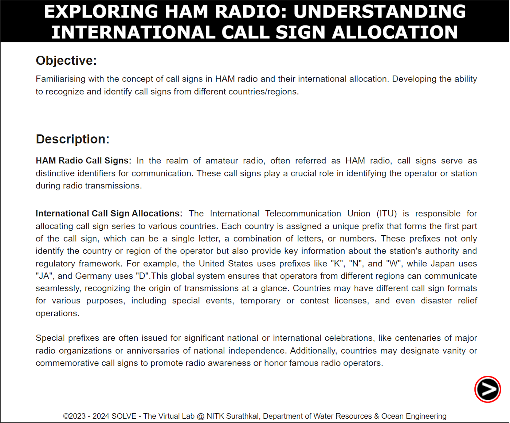
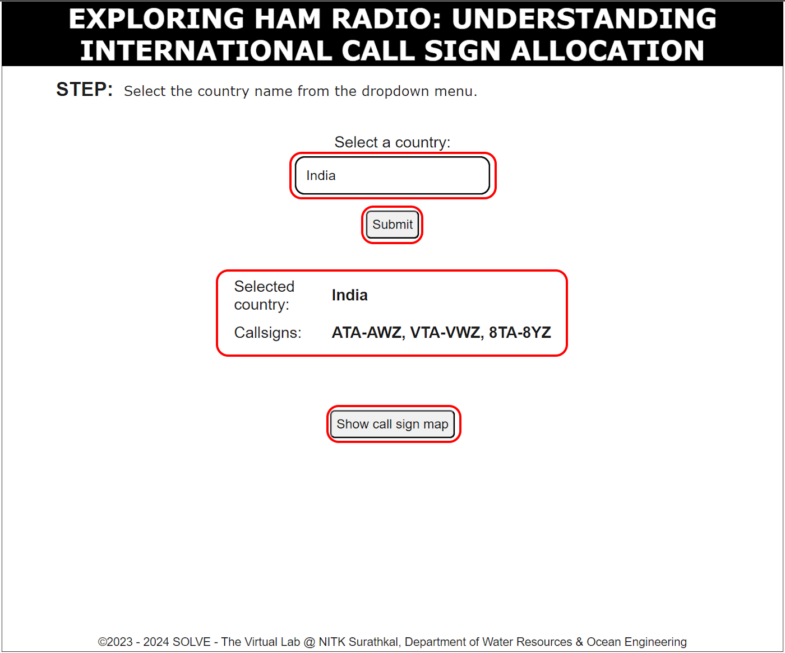

### These procedure steps will be followed on the simulator

1. Open the Call sign simulation and go through the Objective and Description, then click the 'NEXT' button in the bottom right corner.  

3. Choose a country from the dropdown menu or enter the country name inside the input box and select the country then click 'Submit' to see its call signs. To view the map, click 'Show Call Sign Map.' You can repeat this process by selecting different countries. 

